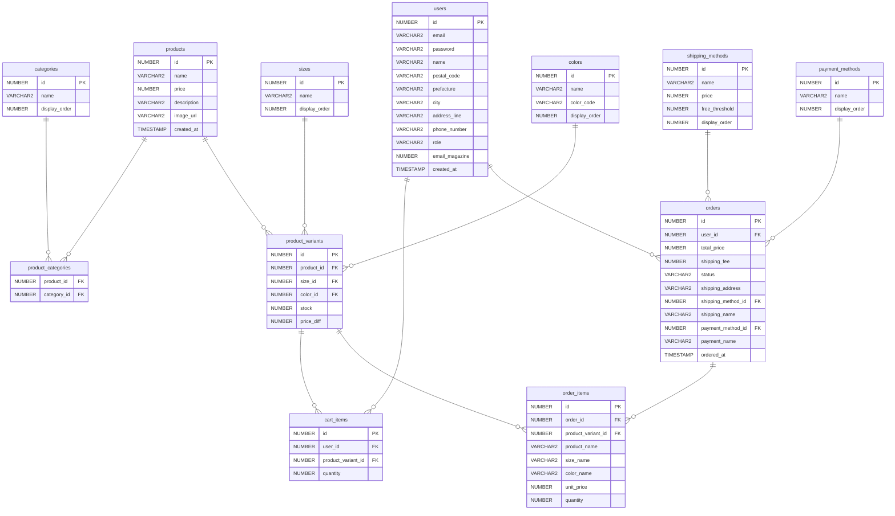
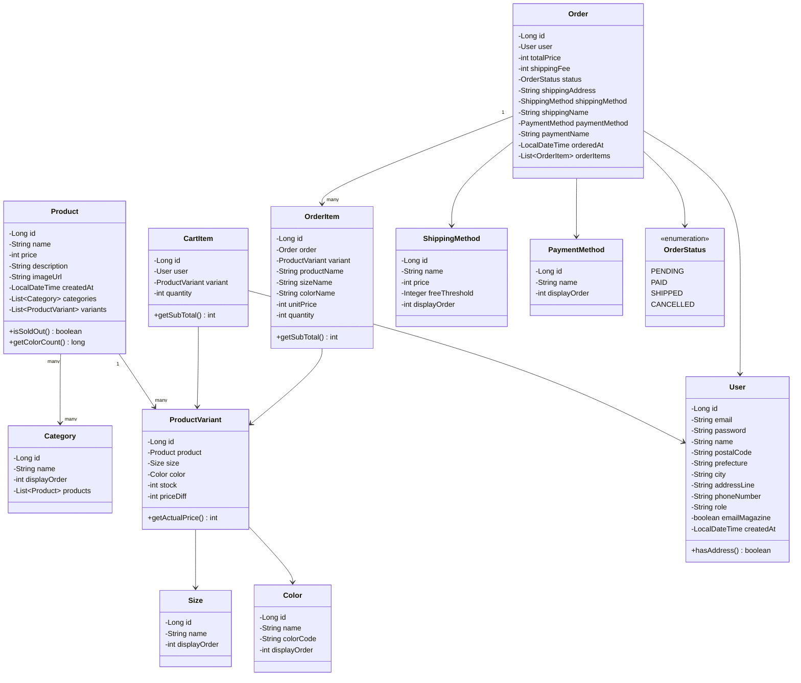
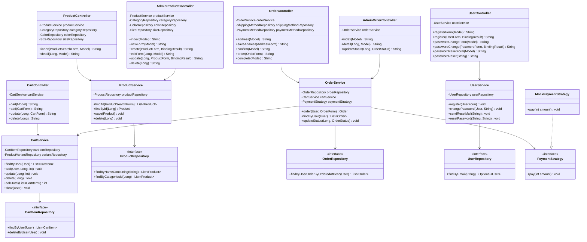
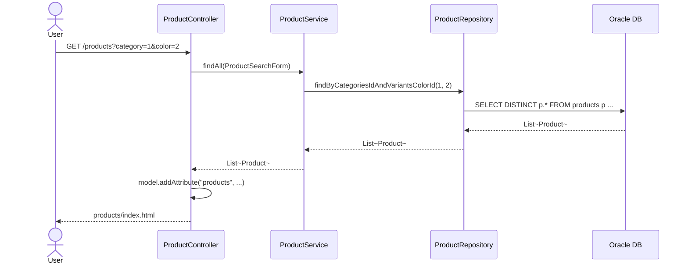
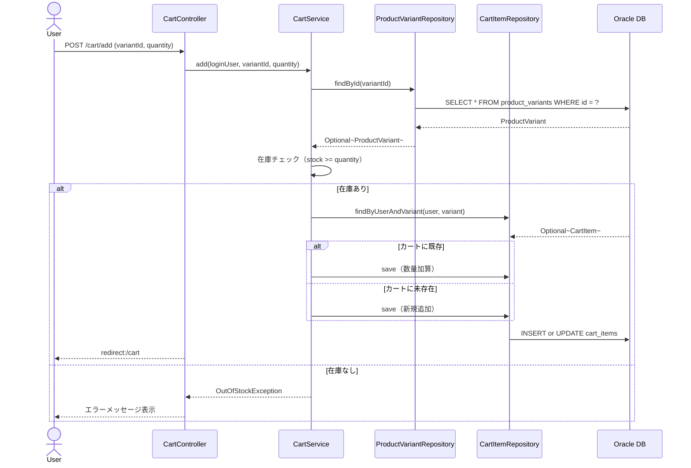
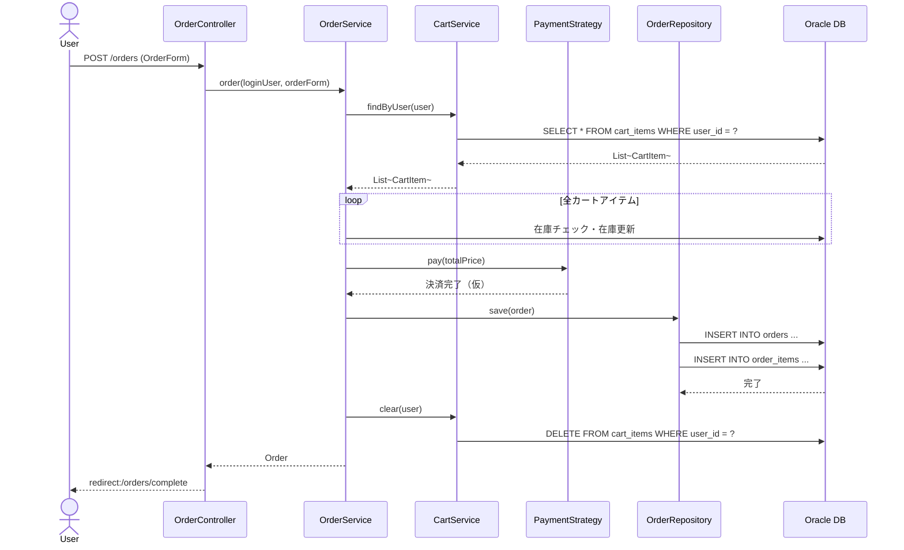
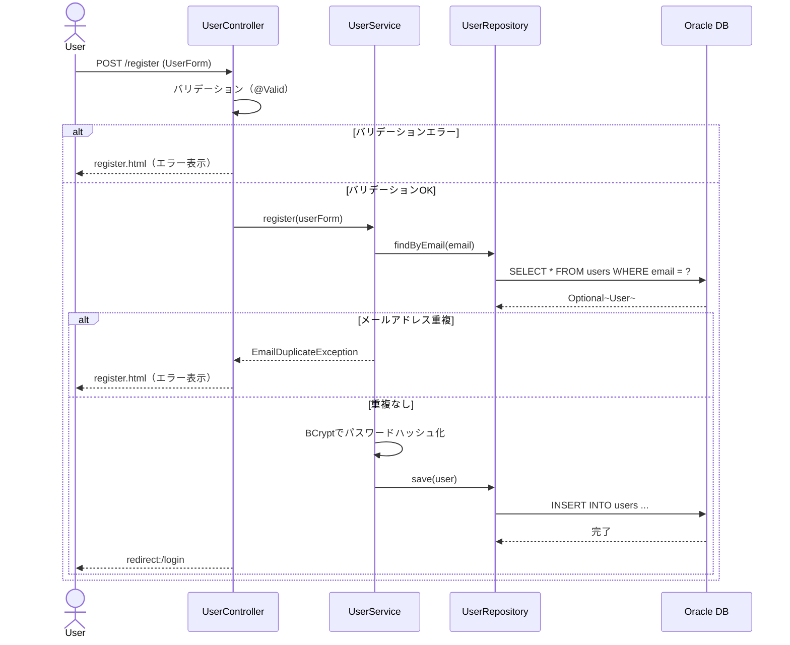
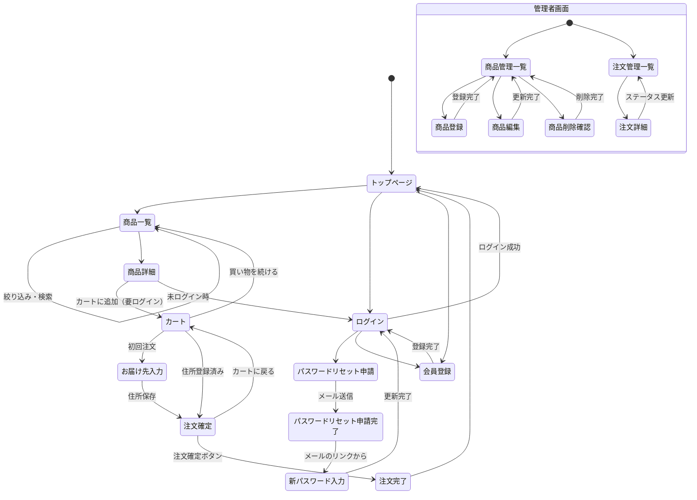

# FGAloha プロジェクト設計書

> **FG = For Gold**（Java SE17 Gold学習兼用）  
> **Aloha** = アロハシャツ専門ECサイト
>
> 🎯 このプロジェクトは **Java SE17 Gold認定試験の学習** と **Spring Boot実践** を兼ねた学習用ECサイトです。  
> 設計書を読みながら自分でコードを書いていくスタイルで進めてください。

---

## 目次

1. [プロジェクト概要](#1-プロジェクト概要)
2. [環境構築手順](#2-環境構築手順)
3. [DB構築手順](#3-db構築手順)
4. [要件定義](#4-要件定義)
5. [設計](#5-設計)
6. [開発規約](#6-開発規約)
7. [テスト仕様書](#7-テスト仕様書)
8. [開発順序](#8-開発順序)
9. [学習ガイド](#9-学習ガイド)

---

## 1. プロジェクト概要

### 目的

- アロハシャツ専門のECサイトをSpring Boot + Oracle + Spring Data JPA + Thymeleafで構築する
- Java SE17 Gold認定試験の学習を兼ねる
- MVC・Formを使ったシンプルな設計を基本とし、実務で使われる定石を身につける

### 技術スタック

| 区分 | 技術 |
|------|------|
| 言語 | Java 17 |
| フレームワーク | Spring Boot 4.0.6 |
| ORM | Spring Data JPA（Hibernate 7） |
| テンプレートエンジン | Thymeleaf |
| DB | Oracle XE（XEPDB1） |
| セキュリティ | Spring Security |
| ビルドツール | Maven |
| IDE | Eclipse（Spring Tools Suite推奨） |
| DBクライアント | Oracle SQL Developer 23.1 |

### 開発方針

- Lombokは使用しない（equals/hashCode/コンストラクタを手で書く）
- DDLは自分で書いて流す（`ddl-auto=none`）
- Service層を中心にTDDを取り入れる
- Java Gold要素（Stream・Optional・ラムダ・デザインパターン等）を意識的に使う

### フェーズ管理

**フェーズ1（今回実装）**
```
商品一覧・詳細・検索・絞り込み
会員登録・ログイン・パスワードリセット
カート機能
注文確定・完了
管理者：商品管理・注文管理
```

**フェーズ2（将来実装）**
```
お気に入り機能
注文履歴
プロフィール編集・プロフィール画像アップロード
ニュース・お知らせ機能
マスタ管理画面
SNSログイン（OAuth2）
メルマガ配信
再販売お知らせ機能
```

---

## 2. 環境構築手順

### 必要なソフトウェア

| ソフトウェア | バージョン | 備考 |
|-------------|-----------|------|
| JDK | 17 | |
| Eclipse | 最新版 | Spring Tools Suite推奨 |
| Oracle XE | 21c以上 | |
| Oracle SQL Developer | 23.1 | |
| Maven | 3.x | Eclipseに同梱 |

### Oracleの設定

```sql
-- xe_systemで接続してPDBに切り替え
ALTER SESSION SET CONTAINER = XEPDB1;

-- DBユーザー作成
CREATE USER fgaloha IDENTIFIED BY your_password;
GRANT CONNECT, RESOURCE TO fgaloha;
GRANT UNLIMITED TABLESPACE TO fgaloha;
```

SQL Developerの接続設定：

| 項目 | 値 |
|------|-----|
| 接続名 | FGAloha |
| ユーザー名 | fgaloha |
| ホスト名 | localhost |
| ポート | 1521 |
| 接続タイプ | サービス名 |
| サービス名 | XEPDB1 |

### Spring Bootプロジェクト設定

**Spring Initializr設定：**

| 項目 | 値 |
|------|-----|
| プロジェクト名 | FGAloha |
| グループ | com.fgaloha |
| パッケージ | com.fgaloha |
| Javaバージョン | 17 |
| Spring Bootバージョン | 4.0.6 |

**依存関係：**
```
Spring Web
Spring Data JPA
Thymeleaf
Oracle Driver
Spring Security
Validation
Spring Boot DevTools
```

### application.properties の設定

> 💡 **チャレンジ①**：以下の項目を自分で `application.properties` に記述してみてください。
> パスワード等の秘密情報は `application-local.properties` に分離するのが定石です。

```properties
# データソース（application-local.properties に記述する）
spring.datasource.url=jdbc:oracle:thin:@localhost:1521/XEPDB1
spring.datasource.username=fgaloha
spring.datasource.password=your_password

# 以下は application.properties に記述する
spring.datasource.driver-class-name=oracle.jdbc.OracleDriver

# JPA
spring.jpa.database-platform=org.hibernate.dialect.OracleDialect
spring.jpa.hibernate.ddl-auto=none
spring.jpa.show-sql=true

# Thymeleaf
spring.thymeleaf.cache=false

# アプリケーション設定
ec.banner.message=¥10,000以上で送料無料
ec.free.shipping.threshold=10000
```

> 💡 **学習ポイント**：`ddl-auto=none` にしている理由は何でしょうか？`create` や `update` との違いを調べてみてください。

---

## 3. DB構築手順

### 実行順序

> 💡 **チャレンジ②**：なぜこの順番で実行する必要があるか考えてみてください。
> ヒント：外部キー（FOREIGN KEY）の `REFERENCES` に注目してみてください。

1. シーケンス作成
2. マスタ系テーブル作成
3. ユーザー系テーブル作成
4. 商品系テーブル作成
5. 購買系テーブル作成
6. 初期データ投入

### シーケンス作成

```sql
CREATE SEQUENCE categories_seq      START WITH 1 INCREMENT BY 1 NOCACHE NOCYCLE;
CREATE SEQUENCE colors_seq          START WITH 1 INCREMENT BY 1 NOCACHE NOCYCLE;
CREATE SEQUENCE sizes_seq           START WITH 1 INCREMENT BY 1 NOCACHE NOCYCLE;
CREATE SEQUENCE shipping_methods_seq START WITH 1 INCREMENT BY 1 NOCACHE NOCYCLE;
CREATE SEQUENCE payment_methods_seq  START WITH 1 INCREMENT BY 1 NOCACHE NOCYCLE;
CREATE SEQUENCE users_seq           START WITH 1 INCREMENT BY 1 NOCACHE NOCYCLE;
CREATE SEQUENCE products_seq        START WITH 1 INCREMENT BY 1 NOCACHE NOCYCLE;
CREATE SEQUENCE product_variants_seq START WITH 1 INCREMENT BY 1 NOCACHE NOCYCLE;
CREATE SEQUENCE cart_items_seq      START WITH 1 INCREMENT BY 1 NOCACHE NOCYCLE;
CREATE SEQUENCE orders_seq          START WITH 1 INCREMENT BY 1 NOCACHE NOCYCLE;
CREATE SEQUENCE order_items_seq     START WITH 1 INCREMENT BY 1 NOCACHE NOCYCLE;
```

### DDL

```sql
-- カテゴリ
CREATE TABLE categories (
    id            NUMBER PRIMARY KEY,
    name          VARCHAR2(100) NOT NULL,
    display_order NUMBER DEFAULT 0
);

-- カラーマスタ
CREATE TABLE colors (
    id            NUMBER PRIMARY KEY,
    name          VARCHAR2(50)  NOT NULL,
    color_code    VARCHAR2(7)   NOT NULL,
    display_order NUMBER DEFAULT 0
);

-- サイズマスタ
CREATE TABLE sizes (
    id            NUMBER PRIMARY KEY,
    name          VARCHAR2(10)  NOT NULL,
    display_order NUMBER DEFAULT 0
);

-- 配送方法マスタ
CREATE TABLE shipping_methods (
    id             NUMBER PRIMARY KEY,
    name           VARCHAR2(100) NOT NULL,
    price          NUMBER(10,0)  DEFAULT 0,
    free_threshold NUMBER        DEFAULT NULL,
    display_order  NUMBER DEFAULT 0
);

-- 支払い方法マスタ
CREATE TABLE payment_methods (
    id            NUMBER PRIMARY KEY,
    name          VARCHAR2(100) NOT NULL,
    display_order NUMBER DEFAULT 0
);

-- ユーザー
CREATE TABLE users (
    id             NUMBER PRIMARY KEY,
    email          VARCHAR2(254) NOT NULL UNIQUE,
    password       VARCHAR2(255) NOT NULL,
    name           VARCHAR2(100) NOT NULL,
    postal_code    VARCHAR2(8),
    prefecture     VARCHAR2(20),
    city           VARCHAR2(100),
    address_line   VARCHAR2(200),
    phone_number   VARCHAR2(15),
    role           VARCHAR2(20)  DEFAULT 'ROLE_USER',
    email_magazine NUMBER(1)     DEFAULT 1,
    created_at     TIMESTAMP     DEFAULT CURRENT_TIMESTAMP
);

-- 商品
CREATE TABLE products (
    id          NUMBER PRIMARY KEY,
    name        VARCHAR2(200) NOT NULL,
    price       NUMBER(10,0)  NOT NULL,
    description VARCHAR2(1000),
    image_url   VARCHAR2(500),
    created_at  TIMESTAMP     DEFAULT CURRENT_TIMESTAMP
);

-- 商品カテゴリ中間テーブル
CREATE TABLE product_categories (
    product_id  NUMBER NOT NULL,
    category_id NUMBER NOT NULL,
    CONSTRAINT pk_product_categories PRIMARY KEY (product_id, category_id),
    CONSTRAINT fk_pc_product  FOREIGN KEY (product_id)  REFERENCES products(id),
    CONSTRAINT fk_pc_category FOREIGN KEY (category_id) REFERENCES categories(id)
);

-- 商品バリアント
CREATE TABLE product_variants (
    id         NUMBER PRIMARY KEY,
    product_id NUMBER       NOT NULL,
    size_id    NUMBER       NOT NULL,
    color_id   NUMBER       NOT NULL,
    stock      NUMBER       NOT NULL,
    price_diff NUMBER(10,0) DEFAULT 0,
    CONSTRAINT fk_pv_product FOREIGN KEY (product_id) REFERENCES products(id),
    CONSTRAINT fk_pv_size    FOREIGN KEY (size_id)    REFERENCES sizes(id),
    CONSTRAINT fk_pv_color   FOREIGN KEY (color_id)   REFERENCES colors(id),
    CONSTRAINT uq_pv         UNIQUE (product_id, size_id, color_id)
);

-- カートアイテム
CREATE TABLE cart_items (
    id                 NUMBER PRIMARY KEY,
    user_id            NUMBER NOT NULL,
    product_variant_id NUMBER NOT NULL,
    quantity           NUMBER NOT NULL,
    CONSTRAINT fk_ci_user    FOREIGN KEY (user_id)            REFERENCES users(id),
    CONSTRAINT fk_ci_variant FOREIGN KEY (product_variant_id) REFERENCES product_variants(id),
    CONSTRAINT uq_ci         UNIQUE (user_id, product_variant_id)
);

-- 注文
CREATE TABLE orders (
    id                 NUMBER PRIMARY KEY,
    user_id            NUMBER        NOT NULL,
    total_price        NUMBER(10,0)  NOT NULL,
    shipping_fee       NUMBER(10,0)  NOT NULL,
    status             VARCHAR2(20)  DEFAULT 'PENDING',
    shipping_address   VARCHAR2(500) NOT NULL,
    shipping_method_id NUMBER        NOT NULL,
    shipping_name      VARCHAR2(100) NOT NULL,
    payment_method_id  NUMBER        NOT NULL,
    payment_name       VARCHAR2(100) NOT NULL,
    ordered_at         TIMESTAMP     DEFAULT CURRENT_TIMESTAMP,
    CONSTRAINT fk_o_user            FOREIGN KEY (user_id)            REFERENCES users(id),
    CONSTRAINT fk_o_shipping_method FOREIGN KEY (shipping_method_id) REFERENCES shipping_methods(id),
    CONSTRAINT fk_o_payment_method  FOREIGN KEY (payment_method_id)  REFERENCES payment_methods(id)
);

-- 注文明細
CREATE TABLE order_items (
    id                 NUMBER PRIMARY KEY,
    order_id           NUMBER        NOT NULL,
    product_variant_id NUMBER        NOT NULL,
    product_name       VARCHAR2(200) NOT NULL,
    size_name          VARCHAR2(10)  NOT NULL,
    color_name         VARCHAR2(50)  NOT NULL,
    unit_price         NUMBER(10,0)  NOT NULL,
    quantity           NUMBER        NOT NULL,
    CONSTRAINT fk_oi_order   FOREIGN KEY (order_id)           REFERENCES orders(id),
    CONSTRAINT fk_oi_variant FOREIGN KEY (product_variant_id) REFERENCES product_variants(id)
);
```

### 初期データ

> 💡 **チャレンジ③**：管理者ユーザーのパスワードは BCrypt でハッシュ化してから INSERT してください。
> Spring Security の `BCryptPasswordEncoder` を使ってテストクラスで生成できます。

```sql
INSERT INTO categories VALUES (categories_seq.NEXTVAL, 'メンズ', 1);
INSERT INTO categories VALUES (categories_seq.NEXTVAL, 'レディース', 2);
INSERT INTO categories VALUES (categories_seq.NEXTVAL, 'ユニセックス', 3);

INSERT INTO colors VALUES (colors_seq.NEXTVAL, 'ホワイト', '#FFFFFF', 1);
INSERT INTO colors VALUES (colors_seq.NEXTVAL, 'ブラック', '#000000', 2);
INSERT INTO colors VALUES (colors_seq.NEXTVAL, 'レッド',   '#FF0000', 3);
INSERT INTO colors VALUES (colors_seq.NEXTVAL, 'ブルー',   '#0000FF', 4);
INSERT INTO colors VALUES (colors_seq.NEXTVAL, 'グリーン', '#00FF00', 5);
INSERT INTO colors VALUES (colors_seq.NEXTVAL, 'イエロー', '#FFFF00', 6);
INSERT INTO colors VALUES (colors_seq.NEXTVAL, 'その他',   '#CCCCCC', 7);

INSERT INTO sizes VALUES (sizes_seq.NEXTVAL, 'XS',  1);
INSERT INTO sizes VALUES (sizes_seq.NEXTVAL, 'S',   2);
INSERT INTO sizes VALUES (sizes_seq.NEXTVAL, 'M',   3);
INSERT INTO sizes VALUES (sizes_seq.NEXTVAL, 'L',   4);
INSERT INTO sizes VALUES (sizes_seq.NEXTVAL, 'XL',  5);
INSERT INTO sizes VALUES (sizes_seq.NEXTVAL, 'XXL', 6);

INSERT INTO shipping_methods VALUES (shipping_methods_seq.NEXTVAL, '通常配送', 0,   10000, 1);
INSERT INTO shipping_methods VALUES (shipping_methods_seq.NEXTVAL, '速達配送', 500, NULL,  2);
INSERT INTO shipping_methods VALUES (shipping_methods_seq.NEXTVAL, '翌日配送', 800, NULL,  3);

INSERT INTO payment_methods VALUES (payment_methods_seq.NEXTVAL, 'クレジットカード', 1);
INSERT INTO payment_methods VALUES (payment_methods_seq.NEXTVAL, 'コンビニ払い',     2);
INSERT INTO payment_methods VALUES (payment_methods_seq.NEXTVAL, '代金引換',         3);

-- パスワードはBCryptでハッシュ化すること（例：BCryptPasswordEncoderで生成）
INSERT INTO users (id, email, password, name, role)
VALUES (users_seq.NEXTVAL, 'admin@fgaloha.com', '$2a$10$xxxxxxxxxxxxxxxxxxxxxx', '管理者', 'ROLE_ADMIN');

COMMIT;
```

---

## 4. 要件定義

### ユーザーストーリー

**ゲスト（未ログイン）**
```
- トップページを見たい
- 商品一覧を見たい
- 商品をカテゴリ・カラー・サイズで絞り込みたい
- キーワードで商品を検索したい
- 商品詳細を見たい
- 会員登録したい
- ログインしたい
```

**一般会員（ログイン済み）**
```
- ゲストの全機能を使いたい
- カートに商品を追加したい
- カートの数量を変更したい
- カートから商品を削除したい
- 注文を確定したい
- パスワードを変更したい
- パスワードをリセットしたい
```

**管理者**
```
- 商品を登録・編集・削除したい
- 商品バリアント（サイズ×カラー×在庫）を管理したい
- 注文一覧を確認したい
- 注文ステータスを更新したい
```

### 機能一覧

| 機能 | ゲスト | 会員 | 管理者 | フェーズ |
|------|--------|------|--------|---------|
| トップページ表示 | ✅ | ✅ | - | 1 |
| 商品一覧・検索 | ✅ | ✅ | - | 1 |
| 商品詳細表示 | ✅ | ✅ | - | 1 |
| 会員登録 | ✅ | - | - | 1 |
| ログイン | ✅ | - | - | 1 |
| ログアウト | - | ✅ | ✅ | 1 |
| パスワード変更 | - | ✅ | - | 1 |
| パスワードリセット | ✅ | - | - | 1 |
| カート操作 | - | ✅ | - | 1 |
| 注文確定 | - | ✅ | - | 1 |
| 商品管理 | - | - | ✅ | 1 |
| 注文管理 | - | - | ✅ | 1 |
| お気に入り | - | ✅ | - | 2 |
| 注文履歴 | - | ✅ | - | 2 |
| プロフィール編集 | - | ✅ | - | 2 |
| マスタ管理 | - | - | ✅ | 2 |

### スコープ外

```
- 実際の決済処理（Stripe等）
- SNSログイン（OAuth2）
- メルマガ配信
- レビュー・評価機能
- ポイント機能
- クーポン機能
```

---

## 5. 設計

### ER図



### 画面一覧

**一般ユーザー向け**

| 画面名 | URL | フェーズ |
|--------|-----|---------|
| トップページ | GET / | 1 |
| 商品一覧・検索結果 | GET /products | 1 |
| 商品詳細 | GET /products/{id} | 1 |
| ログイン | GET /login | 1 |
| 会員登録 | GET /register | 1 |
| パスワード変更 | GET /password/change | 1 |
| パスワードリセット申請 | GET /password/reset | 1 |
| 新パスワード入力 | GET /password/reset/{token} | 1 |
| カート | GET /cart | 1 |
| お届け先入力（初回） | GET /orders/address | 1 |
| 注文確定 | GET /orders/confirm | 1 |
| 注文完了 | GET /orders/complete | 1 |
| プライバシーポリシー | GET /privacy | 1 |
| 利用規約 | GET /terms | 1 |
| 特定商取引法 | GET /legal | 1 |
| 404エラー | /error/404 | 1 |
| 500エラー | /error/500 | 1 |

**管理者向け**

| 画面名 | URL | フェーズ |
|--------|-----|---------|
| 商品一覧 | GET /admin/products | 1 |
| 商品登録 | GET /admin/products/new | 1 |
| 商品編集 | GET /admin/products/{id}/edit | 1 |
| 商品削除確認 | GET /admin/products/{id}/delete | 1 |
| 注文一覧 | GET /admin/orders | 1 |
| 注文詳細・ステータス更新 | GET /admin/orders/{id} | 1 |

### クラス図

#### Entity層



#### Service・Repository・Controller層



---

### シーケンス図

#### 商品一覧・絞り込み



#### カート追加



#### 注文確定



#### 会員登録



---

### 画面遷移図



---

## 6. 開発規約

### パッケージ構成

```
com.fgaloha
├── config
│    └── SecurityConfig.java
├── controller
│    ├── HomeController.java
│    ├── ProductController.java
│    ├── CartController.java
│    ├── OrderController.java
│    ├── UserController.java
│    └── admin
│         ├── AdminProductController.java
│         └── AdminOrderController.java
├── service
│    ├── ProductService.java
│    ├── CartService.java
│    ├── OrderService.java
│    └── UserService.java
├── repository
│    ├── ProductRepository.java
│    ├── CategoryRepository.java
│    ├── ColorRepository.java
│    ├── SizeRepository.java
│    ├── ProductVariantRepository.java
│    ├── CartItemRepository.java
│    ├── OrderRepository.java
│    ├── ShippingMethodRepository.java
│    ├── PaymentMethodRepository.java
│    └── UserRepository.java
├── entity
│    ├── Product.java
│    ├── Category.java
│    ├── Color.java
│    ├── Size.java
│    ├── ProductVariant.java
│    ├── CartItem.java
│    ├── Order.java
│    ├── OrderItem.java
│    ├── OrderStatus.java
│    ├── ShippingMethod.java
│    ├── PaymentMethod.java
│    └── User.java
├── form
│    ├── ProductSearchForm.java
│    ├── CartForm.java
│    ├── OrderForm.java
│    ├── AddressForm.java
│    └── UserForm.java
└── exception
     ├── ProductNotFoundException.java
     ├── OutOfStockException.java
     └── GlobalExceptionHandler.java
```

### 命名規則

| 種別 | 規則 | 例 |
|------|------|-----|
| クラス名 | UpperCamelCase | ProductService |
| メソッド名 | lowerCamelCase | findByCategory |
| 変数名 | lowerCamelCase | productList |
| 定数名 | UPPER_SNAKE_CASE | MAX_STOCK |
| パッケージ名 | 小文字 | com.fgaloha |
| テーブル名 | スネークケース | product_variants |
| カラム名 | スネークケース | created_at |

### コーディング規約

```
1. Lombokは使用しない
2. equals/hashCodeはIDのみで比較する
3. instanceofはパターンマッチングを使う（Java17）
4. @TransactionalはService層にのみ付与する
5. @ManyToOneはFetchType.LAZYを明示する
6. Repositoryの戻り値はOptional<T>を使う
7. nullを返すメソッドを作らない
8. forループよりStreamを優先する
9. 例外はカスタム例外クラスを作成する
10. toStringに遅延ロードフィールドを含めない
```

---

## 7. テスト仕様書

### テスト方針

```
- Service層を中心にTDDを取り入れる
- Repository層は複雑な@Queryのみテストする
- Controller層はフェーズ2以降でテストする
- モックはMockitoを使用する
- アサーションはAssertJを使用する
```

### テストケース一覧（フェーズ1）

**ProductServiceTest**

| # | テストケース | 種別 | 優先度 |
|---|------------|------|--------|
| 1 | 商品IDで商品が取得できる | 正常系 | 高 |
| 2 | 存在しない商品IDでProductNotFoundExceptionが発生する | 異常系 | 高 |
| 3 | カテゴリIDで商品一覧が取得できる | 正常系 | 高 |
| 4 | カラーIDで商品一覧が取得できる | 正常系 | 高 |
| 5 | キーワードで商品一覧が取得できる | 正常系 | 高 |
| 6 | キーワードが空の場合全件取得できる | 正常系 | 高 |
| 7 | 全バリアントの在庫が0の場合isSoldOutがtrueになる | 正常系 | 高 |
| 8 | 1つでも在庫があればisSoldOutがfalseになる | 正常系 | 高 |
| 9 | カラー数が正しくカウントできる | 正常系 | 中 |

**CartServiceTest**

| # | テストケース | 種別 | 優先度 |
|---|------------|------|--------|
| 1 | カートに商品を追加できる | 正常系 | 高 |
| 2 | 同じバリアントを追加すると数量が加算される | 正常系 | 高 |
| 3 | カートから商品を削除できる | 正常系 | 高 |
| 4 | カートの数量を変更できる | 正常系 | 高 |
| 5 | カートの合計金額が正しく計算できる | 正常系 | 高 |
| 6 | 在庫数を超える数量はOutOfStockExceptionが発生する | 異常系 | 高 |
| 7 | カートが空の場合合計金額が0になる | 境界値 | 中 |
| 8 | 数量を0に変更するとカートから削除される | 境界値 | 中 |

**OrderServiceTest**

| # | テストケース | 種別 | 優先度 |
|---|------------|------|--------|
| 1 | 注文が確定できる | 正常系 | 高 |
| 2 | 注文確定時に在庫が正しく減る | 正常系 | 高 |
| 3 | 在庫切れの場合OutOfStockExceptionが発生する | 異常系 | 高 |
| 4 | 注文確定時にカートが空になる | 正常系 | 高 |
| 5 | 注文確定時にOrderItemが正しく生成される | 正常系 | 高 |
| 6 | 送料無料閾値以上で送料が0になる | 正常系 | 中 |
| 7 | 送料無料閾値未満で送料が加算される | 正常系 | 中 |
| 8 | 注文ステータスが正しく更新できる | 正常系 | 中 |

**UserServiceTest**

| # | テストケース | 種別 | 優先度 |
|---|------------|------|--------|
| 1 | 会員登録ができる | 正常系 | 高 |
| 2 | 登録時にパスワードがBCryptでハッシュ化される | 正常系 | 高 |
| 3 | メールアドレス重複時にEmailDuplicateExceptionが発生する | 異常系 | 高 |
| 4 | パスワード変更ができる | 正常系 | 高 |
| 5 | パスワードリセットメールが送信できる | 正常系 | 中 |
| 6 | 存在しないメールアドレスでリセット申請してもエラーにならない | 異常系 | 中 |

---

## 8. 開発順序

### 基本方針

```
依存関係の少ない層から積み上げる
Entity → Repository → Service（TDD）→ Controller → View
```

### ステップ詳細

#### STEP 1：基盤構築
```
✅ 完了済み
├── Oracle XE・SQL Developer設定
├── Spring Bootプロジェクト作成
├── application.properties設定（プロファイル分離）
├── DDL・初期データ投入
└── SecurityConfig（全許可）
```

#### STEP 2：Entity層
```
✅ 完了済み
├── ✅ Color.java
├── ✅ Size.java
├── ✅ ShippingMethod.java
├── ✅ PaymentMethod.java
├── ✅ Category.java
├── ✅ User.java
├── ✅ Product.java（@ManyToMany Category）
├── ✅ ProductVariant.java（@ManyToOne Product・Size・Color）
├── ✅ CartItem.java（@ManyToOne User・ProductVariant）
├── ✅ Order.java（@ManyToOne User・ShippingMethod・PaymentMethod）
├── ✅ OrderItem.java（@ManyToOne Order・ProductVariant）
└── ✅ OrderStatus.java（Enum）

各Entityで確認すること：
├── @SequenceGeneratorの設定
├── @ManyToOneはFetchType.LAZY
├── equals/hashCodeはIDのみ（パターンマッチング使用）
├── toStringに遅延ロードフィールドを含めない
└── @PrePersistでcreatedAt自動セット（Product・User・Order）
```

#### STEP 3：Repository層
```
✅ 完了済み
├── ✅ ColorRepository
├── ✅ SizeRepository
├── ✅ ShippingMethodRepository
├── ✅ PaymentMethodRepository
├── ✅ CategoryRepository
├── ✅ UserRepository（findByEmail）
├── ✅ ProductRepository（findByNameContaining・findByCategoriesId）
├── ✅ ProductVariantRepository
├── ✅ CartItemRepository（findByUser・deleteByUser）
└── ✅ OrderRepository（findByUserOrderByOrderedAtDesc）

各Repositoryで確認すること：
├── JpaRepository<Entity, Long> を継承（インターフェース同士はextends）
├── 継承時にジェネリクスで型を確定させる
├── メソッド名規則でSQLが自動生成される
├── 戻り値はOptional<T>を使う
└── CascadeType.ALL（Order → OrderItem のみ）
```

#### STEP 4：Service層（TDD）
```
⬜ 未着手
ProductService → CartService → OrderService → UserService
の順でTDDで実装

Red（テスト作成）→ Green（実装）→ Refactor の繰り返し
```

#### STEP 5：商品機能
```
⬜ 未着手
├── HomeController（トップページ）
├── ProductController（一覧・詳細）
└── Thymeleafテンプレート作成
```

#### STEP 6：認証機能
```
⬜ 未着手
├── UserController（会員登録）
├── Spring Securityの本設定
└── パスワードリセット（JavaMailSender）
```

#### STEP 7：カート・注文機能
```
⬜ 未着手
├── CartController
└── OrderController
```

#### STEP 8：管理者機能
```
⬜ 未着手
├── AdminProductController
└── AdminOrderController
```

#### STEP 9：仕上げ
```
⬜ 未着手
├── エラーページ（404・500）
├── 静的ページ（利用規約・プライバシーポリシー・特定商取引法）
└── 全体を通した動作確認
```

---

## 9. 学習ガイド

> このセクションはコードを書きながら学ぶためのガイドです。  
> 答えを見る前に、自分で考えてみることを強く推奨します！

### Java Gold 要素マッピング表

| Gold要素 | 使用箇所 | 具体例 |
|---------|---------|--------|
| Stream | ProductService | 商品絞り込み・カラー数カウント |
| Collectors | ProductService | groupingBy でカラーグループ化 |
| Optional | 全Repository | orElseThrow・ifPresent |
| ラムダ式 | 全Service | Comparator・Predicate |
| ジェネリクス | Result\<T\>クラス | 汎用APIレスポンスラッパー |
| パターンマッチング | 全Entity | equals/hashCodeのinstanceof |
| CompletableFuture | OrderService | 注文確定後のメール送信非同期化 |
| デザインパターン（Strategy） | OrderService | 支払い方法の切り替え |
| デザインパターン（Factory） | OrderService | 支払い戦略の生成 |
| Enum | OrderStatus | OrderStatusのEnum定義 |
| @PrePersist | Product・User・Order | createdAt/orderedAtの自動セット |

### コーディングチャレンジ一覧

各STEPで意識してほしいチャレンジをまとめました。

**STEP 1チャレンジ**
- [ ] `application.properties` と `application-local.properties` の分離理由を説明できる
- [ ] `ddl-auto=none` にしている理由を説明できる
- [ ] BCryptパスワードをテストクラスで生成できる

**STEP 2チャレンジ**
- [ ] `@ManyToOne` / `@OneToMany` / `@ManyToMany` の使い分けを説明できる
- [ ] オーナー側・非オーナー側の判断基準を説明できる
- [ ] `mappedBy` に何を書くべきか説明できる
- [ ] Java17のパターンマッチングで `equals` を書ける
- [ ] `equals` と `hashCode` をセットで実装する理由を説明できる
- [ ] `@PrePersist` で `createdAt` を自動セットできる
- [ ] `Stream.allMatch()` と `Stream.of()` を使って `hasAddress()` を書ける
- [ ] `Stream.map().distinct().count()` を使って `getColorCount()` を書ける
- [ ] `toString` にリレーションを含めてはいけない理由を2つ説明できる

**STEP 3チャレンジ**
- [ ] `JpaRepository` が継承だけで使えるメソッドを5つ以上挙げられる
- [ ] インターフェース同士の継承に `extends` を使う理由を説明できる
- [ ] 継承時にジェネリクスで型を確定させる意味を説明できる
- [ ] メソッド名規則（findBy・OrderBy・Containing・Desc等）を使える
- [ ] `Optional<T>` を戻り値に使ったRepositoryメソッドを書ける
- [ ] `CascadeType.ALL` が必要なケースとそうでないケースを説明できる
- [ ] ライフサイクルの観点でcascadeの要否を判断できる
- [ ] `@Query` でJPQLを書ける（STEP4で実践）

**STEP 4チャレンジ**
- [ ] Red → Green → Refactor のサイクルでTDDを実践できる
- [ ] `Optional.orElseThrow()` でカスタム例外を投げられる
- [ ] `Stream` と `Collectors.groupingBy()` を使って商品を集計できる
- [ ] Strategy パターンで支払い処理を実装できる
- [ ] `CompletableFuture` でメール送信を非同期化できる

### よくある間違いと対処法

```
❌ @ManyToOne で FetchType を指定し忘れる
→ デフォルトが EAGER でN+1問題が発生する

❌ equals をオーバーライドして hashCode を忘れる
→ HashSet・HashMap が正しく動かない

❌ toString にリレーションフィールドを含める
→ StackOverflowError または LazyInitializationException

❌ application-local.properties を .gitignore に追加し忘れる
→ パスワードがGitHubに公開されてしまう

❌ @Enumerated(EnumType.STRING) を忘れる
→ DBに 0, 1, 2... と数値で保存されて意味不明になる

❌ @PrePersist で管理するフィールドに setter を作ってしまう
→ 外から誤って上書きされるリスクがある

❌ CascadeType.ALL を安易に全@OneToManyに付ける
→ 意図しない削除・更新が発生するリスクがある
→ ライフサイクルが独立しているEntityには付けない

❌ Repository のメソッド引数の型を間違える
→ findByUser(User user) の引数は User（List<CartItem>ではない）
→ JPAがオブジェクトからIDを自動抽出してくれる
```

---

*最終更新：STEP3（Repository層）完了時点*
